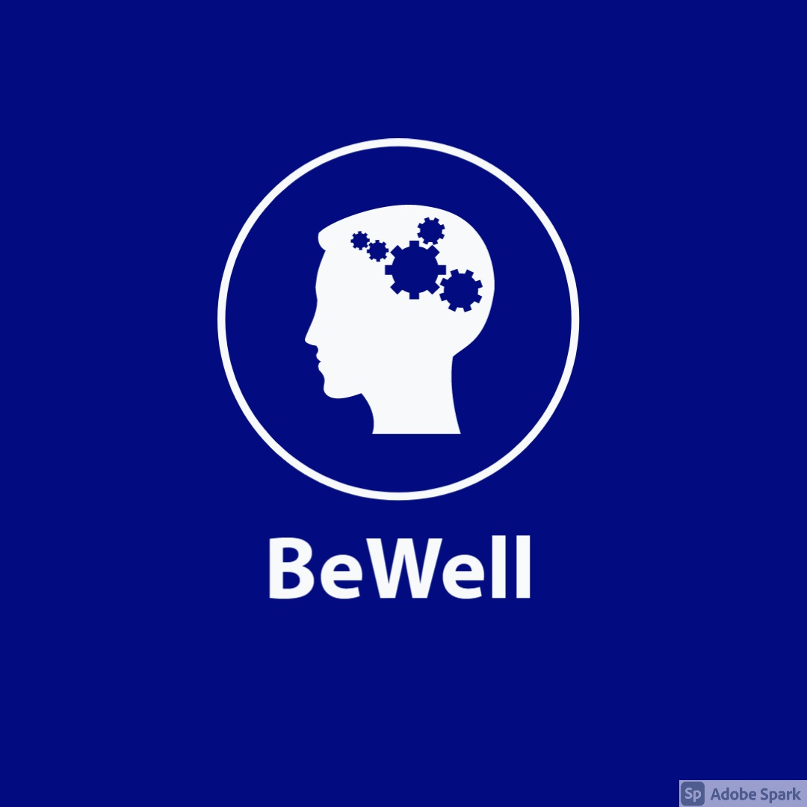
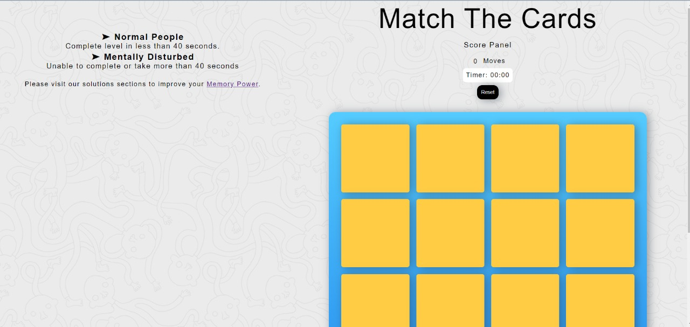
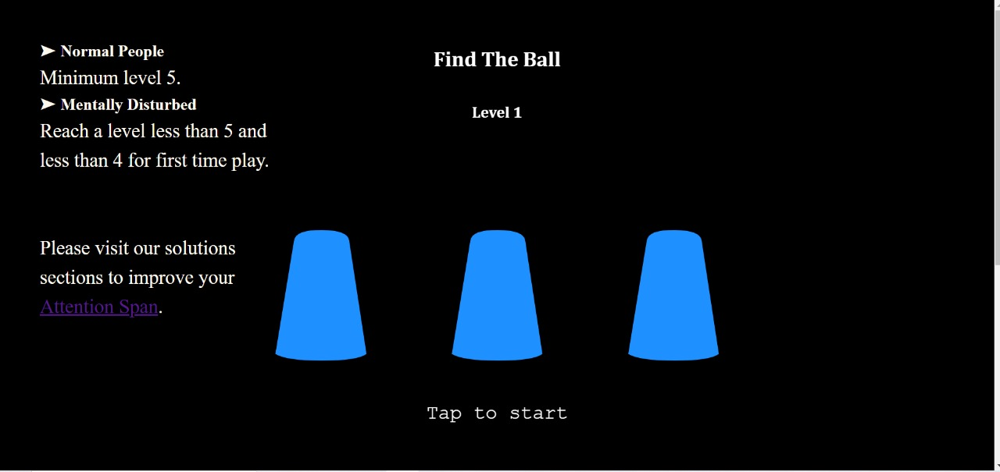
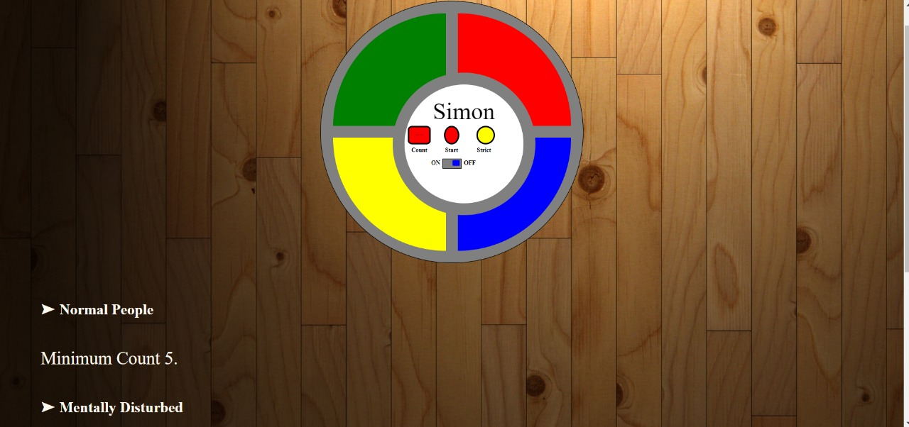
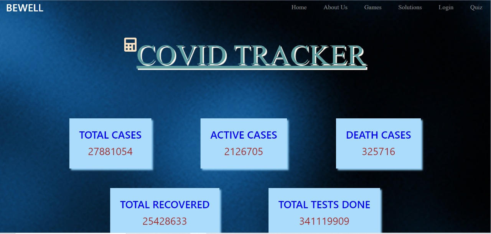
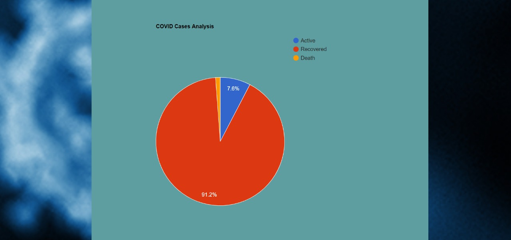
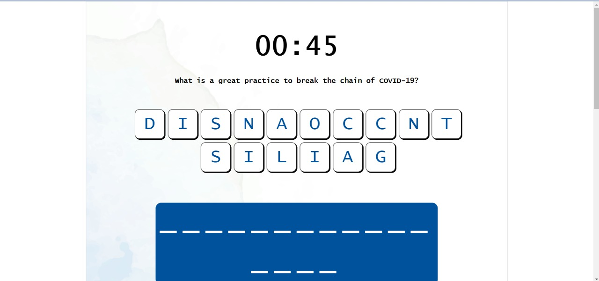

 <h1> BEWELL </h1>
       
## Problem Statement :
COVID-19 pandemic and lockdown has brought about a sense of fear and anxiety. This phenomenon has led to short term as well as long term psychological and mental health problems in people. Also, mental health services are disrupted because of the pandemic, people are not able to visit psychologists / counsellors which is further exaggerating the problem. So, to cope up with this issue there is a need to find out a way by which individuals can keep a check on their mental health conditions while staying at home.

## Theme :
BeWell is a web app that analyses the psychological and mental health conditions of an individual and provide solutions to improve the health conditions. It conducts fun game based psychological test which helps user to know the his/her current mental health status by comparing it with the mentioned critical score of each test and provides solutions to improve the mental health conditions.

## Idea Effectiveness :
According to recent studies there has been 41% increase in anxiety disorders cases and 67% increase in suicide cases during pandemic. So, BeWell will help people to identify these issues on time and take  necessary steps to improve the conditions and provide care to those  people who are at risk of serious mental complications. 

## Psychological Tests :

1. **Card Matching :** Tests the memory of the user.  
*How to play?*  
On the game board, there are always two identical images. User starts the game by flipping a card. Then try to find another card that has the same image as the first. If pair is not found, the flipped cards will be flipped back with the face down. User needs to remember these images as it becomes easier to find pairs quickly. When user finds a pair they are removed from the board and when all pairs are found, level will be completed and time will be recorded.  

 

2. **Track the Ball :** Tests the concentration power of the user.  
*How to play?*  
Game starts with ball shown in one of the three containers and then the containers are shuffled and user needs to select the container having the ball. If correct container is selected then user win and score is increased else user lost the game. User needs to concentrate on the required container while shuffling to predict the right container at last.

3. **Simon :** Tests the attention span of the user.  
*How to play?*  
Game starts with some musical note that has to be copied by the user by clicking on different colored divisions. For each correct click user earns the score and for any wrong click game will get over and final score will be generated. Score represents the amount of time for which user was able to keep the attention on the board and remember the notes.

***Critical Scores are set after consulting the professionals and referring to their blogs and articles.***

## Solutions :
1. **Meditation App :**
2. **Exercise Recommendations :**
3. **Do and Don't tips :**

## Covid Tracker :
* BeWell Covid Tracker include statistics like recovery rates and testing rates along with total cases, positivity rates and death rates which not only keeps user updated with all the information but also develops a feeling of motivation by observing the high recovery rates and declining positivity rates not only highlighting the negative information. 
* Also, there is piechart plotted by using Google Charts API showing the current status of COVID cases which clearly displays that recovery rate is much higher than the mortality rate which develops a positive feeling in user. 
 

## Fun Quiz :
* This section is basically for kids to learn about COVID and its related terms by while playing unscrambling game. It is not only a great way to make them learn about COVID but also helps to boost their working memory.

***Whenever user logins to the app and play any of the psychological game tests his/her result is stored with his profile and he/she can refer to previously stored results anytime in future by just logging in the app. This way user can track progress or improvement in his/her mental health conditions.***

## Technology Used :
- HTML
- CSS
- Bootstrap
- Javascript
- JQuery
- MongoDB

## API Reference :
- [Google Charts API](https://www.gstatic.com/charts/loader.js)
- [Covid Tracking API](https://corona.lmao.ninja/v2/countries/India?strict&query%20) 
